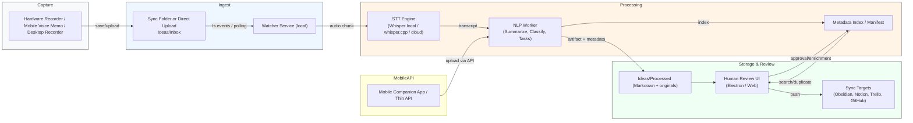
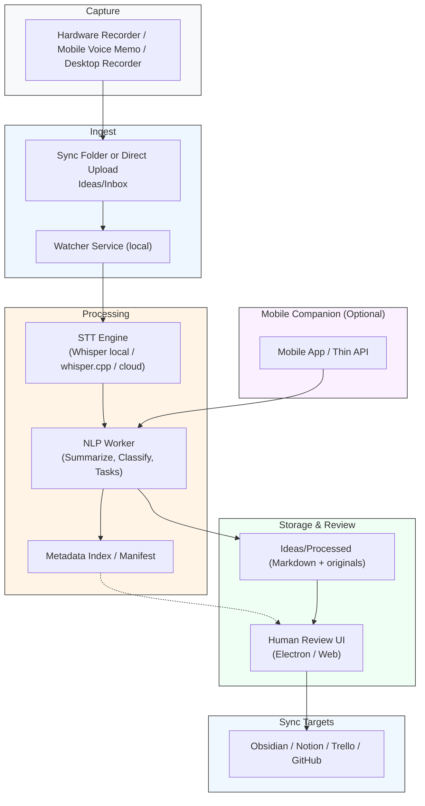

## Architecture Diagram — AI Thought Capture (Watcher-first MVP)

This document describes the recommended system architecture for the AI Thought Capture MVP. It focuses on a watcher-driven, local-first ingestion path (Windows development) while noting cross-platform and mobile options.

### High-level diagram (Mermaid)

### Portrait-oriented diagram (Mermaid)

### Components & responsibilities

- Hardware Recorder / Mobile Recorder
  - Produces audio files (.wav/.mp3/.m4a/.flac) with a naming convention.
  - Minimal metadata: timestamp, source label.

- Sync Folder / Direct Upload (Ideas/Inbox)
  - A single shared input surface. Could be local folder (OneDrive/Dropbox/Obsidian vault) or an upload endpoint from a mobile app.

- Watcher Service (local-first)
  - Watches the inbox folder for new files. Ensures file stability (size/durations), enforces naming conventions, deduplicates, and hands audio to the STT engine.
  - Emits deterministic artifacts (Markdown files + metadata) into `Ideas/Processed` on success, moves to `Ideas/Failed` on error.
  - Contract: Inputs: file path; Outputs: Markdown artifact path and original moved to processed/originals.

- STT Engine
  - Converts audio chunks to text. Options:
    - whisper-local (python/OpenAI Whisper)
    - whisper.cpp (fast local C++ build, good for offline)
    - cloud STT (OpenAI, AssemblyAI) for higher accuracy or convenience
  - Exposure: provide a small adapter interface with signature transcribe(file_path) -> {transcript, confidence, duration}

- NLP Worker
  - Runs summarization, classification, task generation using an LLM.
  - Produces title, short summary, classification label, suggested tasks, and optional tags.
  - Can be synchronous (small local prompt) or queued for async processing.

- Metadata Index / Manifest
  - Small JSON/SQLite store of processed items: file hashes, timestamps, status, and pointers to markdown files.
  - Enables idempotency, duplicate detection, search, and simple UI listing.

- Human Review UI
  - Lightweight app (Electron or web) that lists processed items, allows approve/reclassify/merge, and triggers push to sync targets.

- Sync Targets
  - Push verified or tagged artifacts to: Obsidian vault (move/copy md), Notion database via API, Trello/GitHub Issues for tasks, or cloud storage.

### Data flow & contracts (concise)

- Ingest contract: file appears in `Ideas/Inbox`.
- Watcher contract: on stable file -> compute hash -> if unprocessed -> call STT Adapter -> write Markdown via NLP Worker -> add manifest entry.
- STT Adapter contract: returns transcript, confidence [0..1], duration_seconds.
- Markdown artifact contract: YAML/frontmatter with title, created_at (iso8601), source_file, duration, stt_engine, stt_confidence, classification, tags, status.

### Reliability & failure modes

- Partial file writes: solved by file-size-stability checks and retries.
- Cloud sync races (OneDrive/Dropbox): handle by waiting for stable size and using file-hash-based idempotency.
- STT failures: move original file to `Ideas/Failed` and create a failed manifest entry with error.
- Low-confidence transcripts: mark status `needs_review` and surface in UI.

### Cross-platform & mobile considerations

- Windows (primary dev): Use `watchdog` for native FS events; provide PowerShell runner and optional Windows service wrapper.
- macOS / Linux: same watcher code works with `watchdog` and path handling via `pathlib`.
- Mobile (iOS/Android): Two ingestion options:
  1. File sync: Use platform voice memo + auto-sync to cloud folder that the watcher monitors.
  2. Mobile companion: upload via API endpoint (requires adding an ingest HTTP server) — useful for low-latency uploads and metadata capture.

### Deployment & scale notes (MVP → v1)

- MVP (local single-user): Watcher + local STT (or cloud STT) + local markdown → easy to demo and iterate.
- v1 (multi-device single-user): Add background worker queue, manifest DB, and optionally an HTTP ingest endpoint for mobile uploads.
- v2 (multi-user / SaaS): Move STT and NLP to scalable workers (Celery/RQ/Kafka) running on cloud VMs or serverless; central DB; authentication and per-user vaults.

### Security & privacy

- Local-first: default to local STT to keep recordings private. Document how to configure a cloud STT and require explicit opt-in.
- Secure cloud upload paths with TLS and API keys when enabling remote ingestion.

### Suggested next steps (practical)

1. Finalize artifact schema (YAML fields) and manifest fields.
2. Implement watcher (done) and STT adapter (next): choose local Whisper or cloud OpenAI.
3. Implement manifest store (SQLite) to record processed file hashes and streamlines UI listing.
4. Build a minimal Electron review UI that reads `Ideas/Processed` and allows approve/reclassify/push.

---

File added to repo: `architecture/architecture_diagram.md` — if you want, I can export a PNG/SVG of the mermaid diagram or create a more visual diagram (draw.io / Lucid) next.
